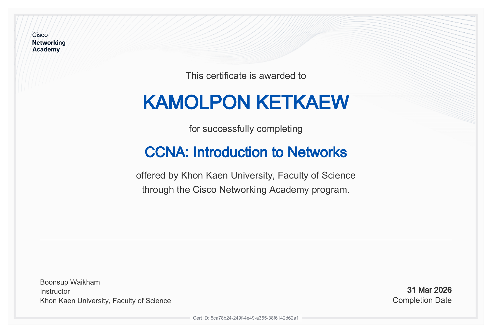
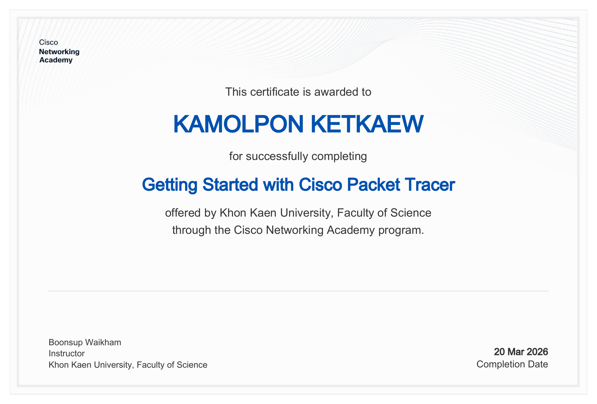

## Personal Portfolio — Network & Systems 2025–2026

> รวมงานทั้งหมดที่ทำตลอดเทอม วิชา **CP352005 Computer Networks**

---

## สรุปงานทั้งหมดที่ได้ทำในเทอมนี้

| หมวด | จำนวน |
|------|--------|
| 🧪 Lab | 6 |
| 📝 Assignment | 4 |
| 🔗 New Network | 1 |
| 🚀 Term Project | 1 |
| 🏅 Certificate | 2 ใบ |

---

## Assignment
 
| # | ชื่องาน | รายละเอียด |
|---|---------|------------|
| 01 | Essay Link | [View](./Assignment/Assignment1.pdf) |
| 02 | Topology | [View](./Assignment/Assignment2.pdf) |
| 03 | Not_Simple | [View](./Assignment/Assignment3.pdf) |
| 04 | TCP-UDP | [View](./Assignment/Assignment4.pdf) |
| 05 | New Network | [View](./New%20Network/New%20Network.pdf) |

---

## Lab
 
| # | ชื่องาน | รายละเอียด |
|---|---------|------------|
| 01 | Lab Report 1 | — |
| 02 | Lab Report 2 | — |
| 03 | Lab Report 3 | — |
| 04 | Lab Report 4 | — |
| 05 | Lab Report 5 | — |
| 06 | Lab Report 6 | — |

---

## 🚀 Term Project

| ชื่อโปรเจ็ค | รายละเอียด |
|------------|------------|
|Infrastructure-Free-Emergency-Communication-Network|[Link Github](https://github.com/lloganlrithm/Infrastructure-Free-Emergency-Communication-Network)|

---

## 🏅 Certificate

### CCNA: Introduction to Networks

### Getting Started with Cisco Packet Tracer

